## Zen - Journal App 
By Tai Nguyen - DH 150

*This project is a heuristic analysis of journal/self care tracking apps through the lens of middle aged women. This will be done by assessing two mobile apps, Jour and Tangerine and comment on what has been done well and what aspects can be improved upon. My overall project that builds off this analysis will be the creation of a simple, easy to use journaling/tracking app that improves mental health and productivity for middle aged women.*

## Jour

[Jour](https://jour.com/) is an interactive journal focused on improving mindfulness, mental health, and sleep. This goal is achieved through daily check ins, questions, and other interactive journaling. 

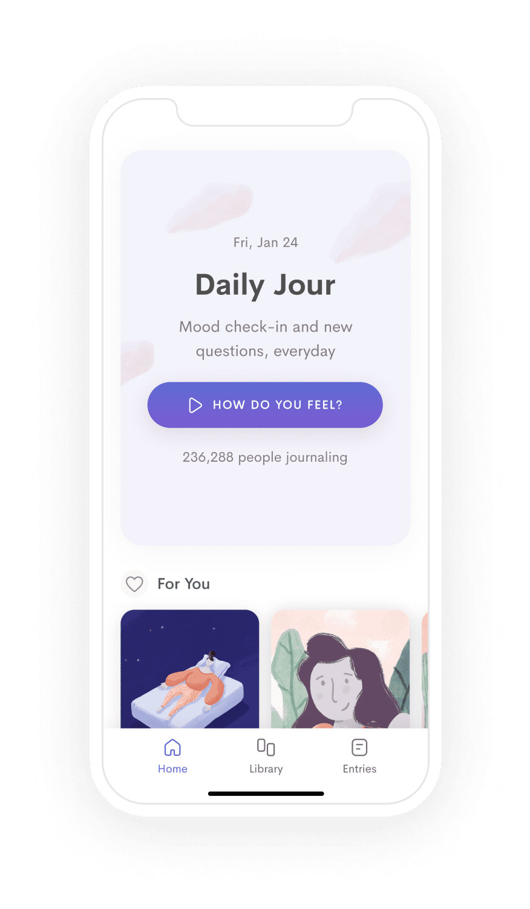
# Overall Evaluation
Jour is a well designed app that both benefits and suffers from its simplicity. The easy and basic design allows for easy user interaction but more information and direction is needed to push users into utilizing the app to its fullest. 

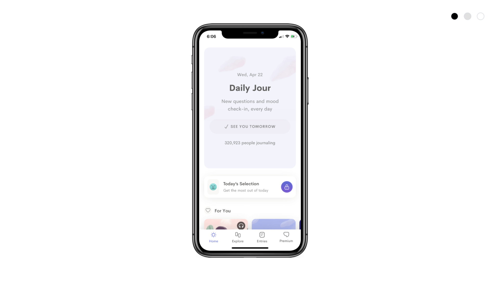
# Visibility of system status: 
*Does the user always have a good idea of their progress or next step?*
| Comments     | Severity Rating |
| ----------- | ----------- |
| After completing the daily journal, Jour does not emphasize where else to go or what other activities are available on the app.     | 3      |
| A fix would be showing users what recommended actions are next such as viewing X tab on the For You page.   | 3        |

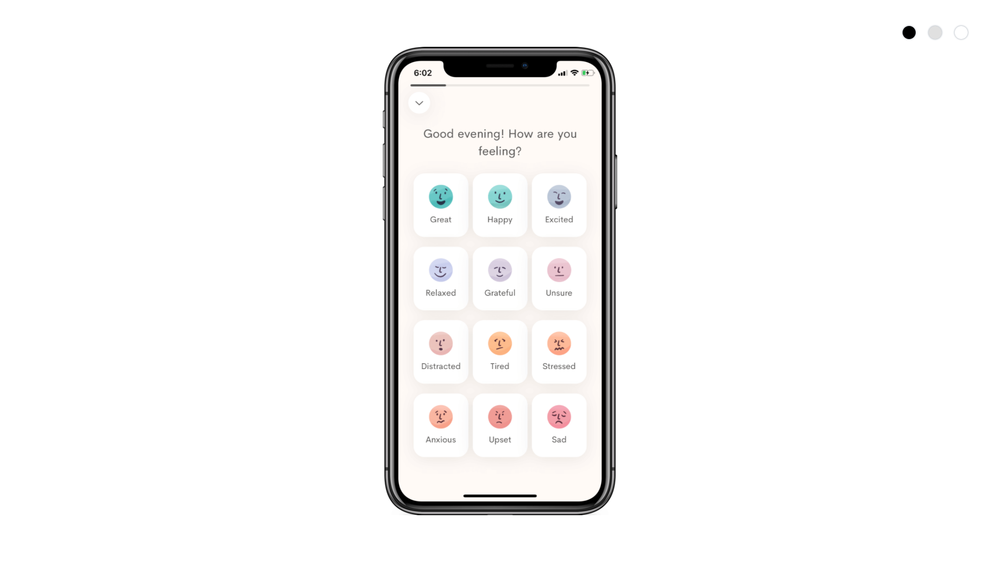
# Match between system and real world: 
*Does the vocabulary and process follow real world vocabulary and natural progressions?*
| Comments     | Severity Rating |
| ----------- | ----------- |
| Jour does a good job at using easy to understand wording as well as illustrations that make it clear what options to choose from.   | 1      |

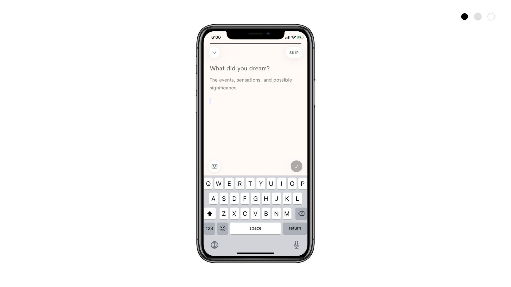
# User control and freedom: 
*Does the app allow the user freedom to undo or move forward from any given action?*
| Comments     | Severity Rating |
| ----------- | ----------- |
| Once users get to the journaling page, there is no way to escape without skipping or completing the process.    | 3      |
| Adding a back button or a dialogue to complete later would solve this.  | 3       |

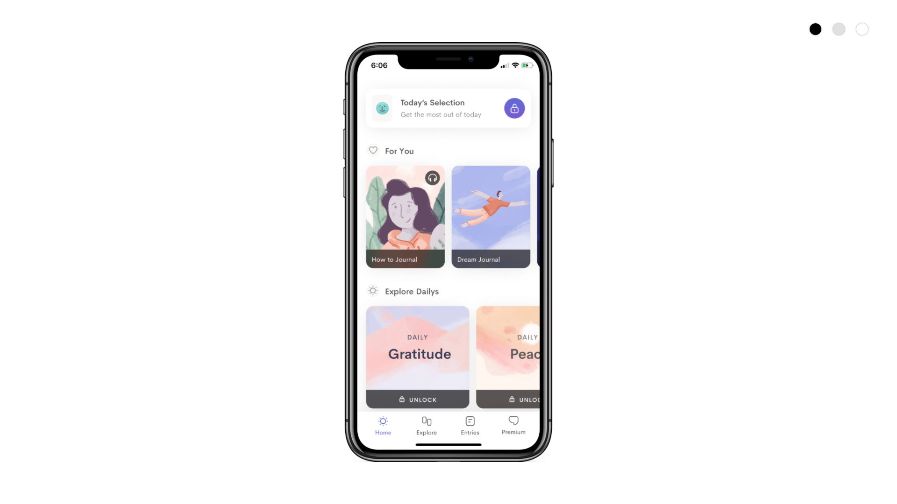
# Consistency and standards: 
*Does the app have consistent vocabulary, functions, and processes from one page to the next?*
| Comments     | Severity Rating |
| ----------- | ----------- |
| Jour remains consistent and simplistic with its vocabulary and functions from page to page. However a small suggestion would be to group functions better. For example, journaling should be on a separate page from exploring or instructionals.     | 2     |

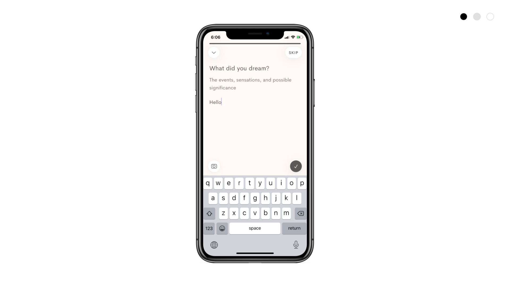
# Error prevention: 
*Does the app have appropriate warnings and feedback to prevent unnecessary user errors?*
| Comments     | Severity Rating |
| ----------- | ----------- |
| Jour's lack of direction and very broad prompts can lead users to being inefficient with their journaling.    | 3      |
| More detailed prompts or perhaps even a character requirement might get users more involved and understand the direction required   | 2        |

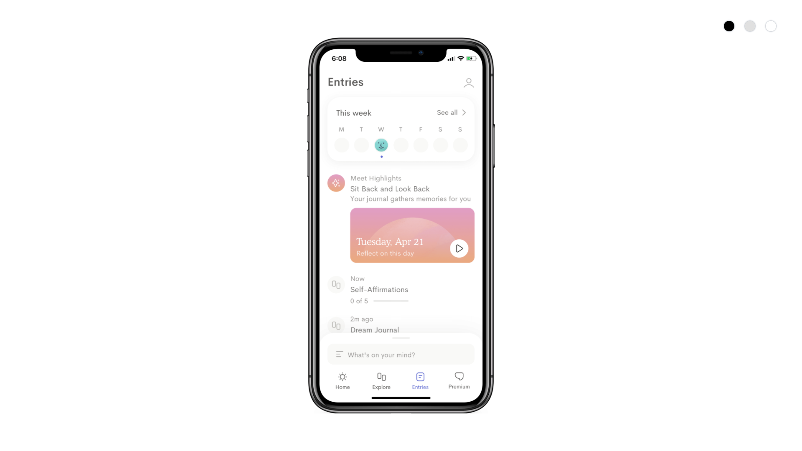
# Recognition rather than recall: 
*Does the app minimize the amount of memorizing the user has to do to proceed through the app?*
| Comments     | Severity Rating |
| ----------- | ----------- |
| Jour's journaling design allows for no need for memorization at all and since there is no complex jargon, there is no memorization component to Jour.      | 1      |

# Flexibility and efficiency of use: 
*Does the app provide learnable but not necessary accelerators to allow experienced users to move more efficiently?*
| Comments     | Severity Rating |
| ----------- | ----------- |
| Jour does not have any accelerators, but the app is straightforward and simple enough that no accelerators are necessary to be efficient.     | 1       |

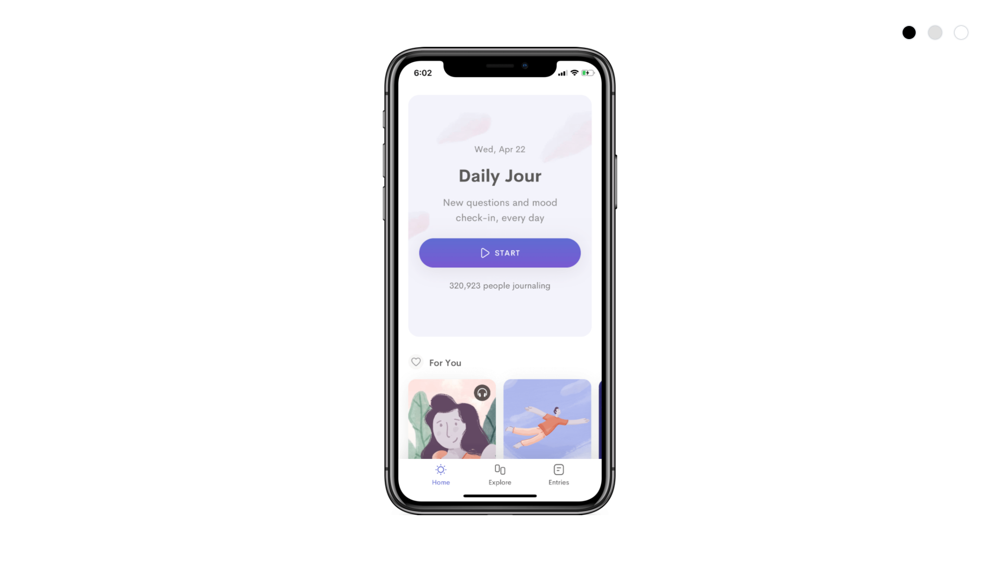
# Aesthetic and minimalist design: 
*Are the imporant functions clearly highlighted and is unnecessary or distraction features removed?*
| Comments     | Severity Rating |
| ----------- | ----------- |
| Extraneous information such as the number of people journaling is distracting and does not contribute at all to the goal of the app    | 2      |
| More focus should be put on other functions of the app such as the For You bar   | 2        |

# Help users recognize, diagnose, and recover from errors: 
*Does the app allow for easy and clear diagnosing of any errors the user might encounter?*
| Comments     | Severity Rating |
| ----------- | ----------- |
| Jour does not currently provide any error messages due to the freedom involved in the app outside of onboarding. There is not much room for error so this is not an issue     | 1      |

# Help and documentation: 
*Does the app provide useful information that may aid the user through any troubles or questions they might encounter?*
| Comments     | Severity Rating |
| ----------- | ----------- |
| Jour does not provide any sort of real feedback on if what is journaled is actually useful or helpful at the moment. However, this is not a severe issue as freedom is a central aspect of journaling.  | 1      |
| Providing more of a guide or even examples of a good journal would eliminate this issue.  | 1      |

## Tangerine

[Tangerine](https://tangerine.app/) is a habit and mood tracking mobile application that aims to improve mental health and wellness through journaling, creating routines, and statistical analysis. 

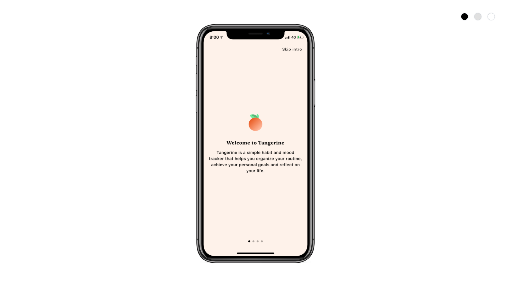

# Overall Evaluation
Tangerine benefits from a simplistic design but could have a more easily understandable design language and more clear information. Overall, Tangerine should help users have a more clear direction and prevent any errors while also attempting to relate more to real world systems that would appeal to all demographics. 

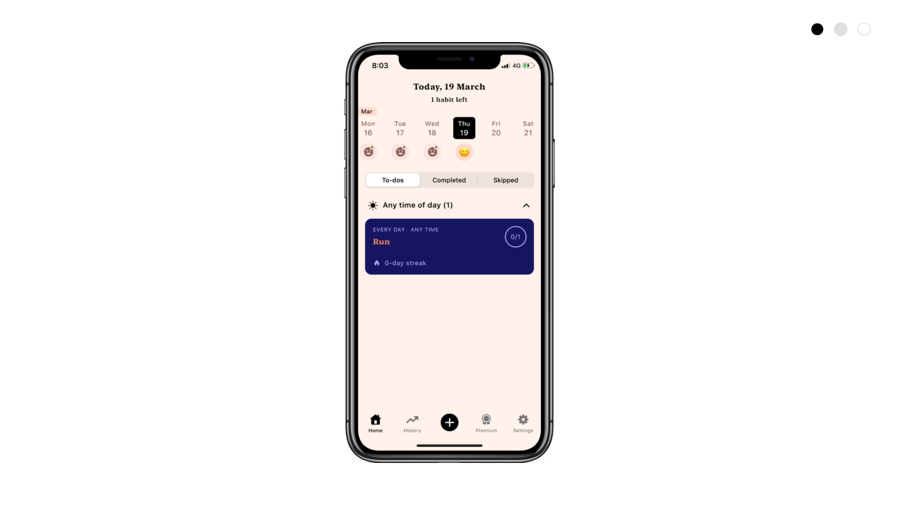
# Visibility of system status: 
*Does the user always have a good idea of their progress or next step?*
| Comments     | Severity Rating |
| ----------- | ----------- |
| This screen shows users clearly what actions are on the to-do list and what has been done throughout the week.     | 1      |
| A small suggestion would be introducing what benefits users can obtain from navigating to other pages than this one.   | 1       |

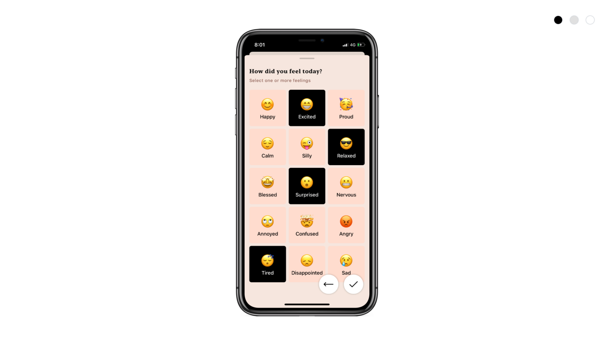
# Match between system and real world: 
*Does the vocabulary and process follow real world vocabulary and natural progressions?*
| Comments     | Severity Rating |
| ----------- | ----------- |
| Graphics and vocabulary such as those displayed here are not as clear or straightforward as possible and may not appeal to demographics such as middle aged women  | 3      |
| A fix for this would be implementing more clear and universal icons such as those implemented in Jour   | 3       |

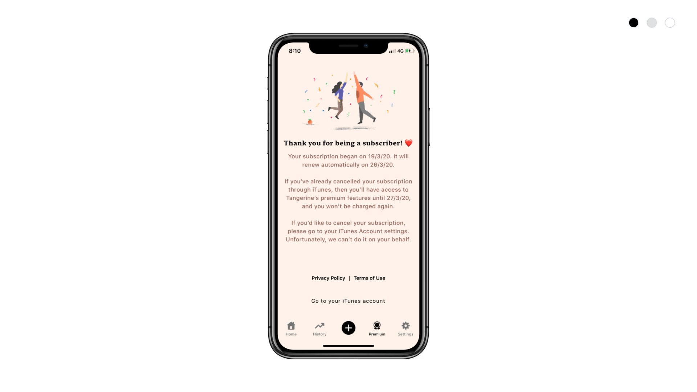
# User control and freedom: 
*Does the app allow the user freedom to undo or move forward from any given action?*
| Comments     | Severity Rating |
| ----------- | ----------- |
| Pages like these are empty with no clear way of escaping or going back to a relevant page.    | 2     |
| A solution would be to add a more clear button to take users to a different page or where they should be, such as a back button or go here dialogue.  | 2       |

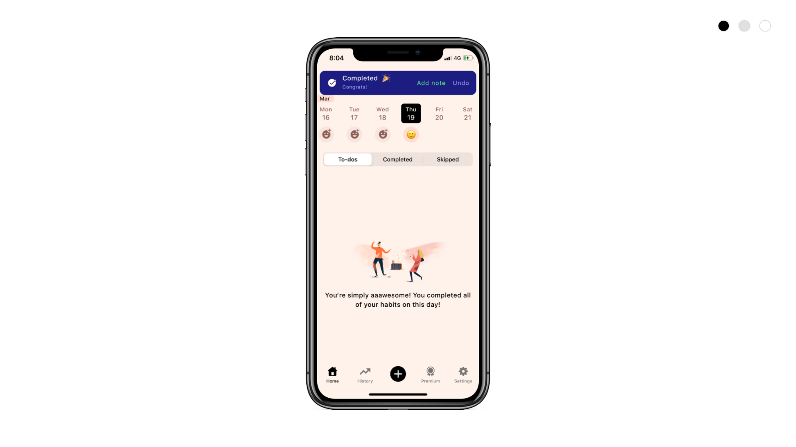
# Consistency and standards: 
*Does the app have consistent vocabulary, functions, and processes from one page to the next?*
| Comments     | Severity Rating |
| ----------- | ----------- |
| Some vocabulary could remain more consistent and clear. For example, this page uses the word completing habits whereas the weekly review page refers to them as 'completions'. A solution would be to standardize all wording to be concise.    | 2     |

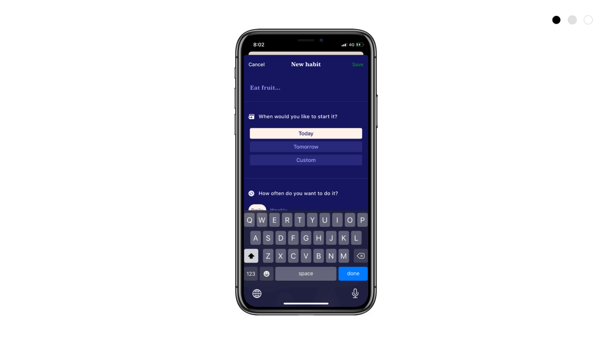
# Error prevention: 
*Does the app have appropriate warnings and feedback to prevent unnecessary user errors?*
| Comments     | Severity Rating |
| ----------- | ----------- |
| Tangerine provides mostly clear options for each of its habits and tracking. However, it would be best to show what answers are required to move forward and be more clear in its prompts.   | 2      |
| More detailed prompts or perhaps even a character requirement might get users more involved and understand the direction required   | 2        |

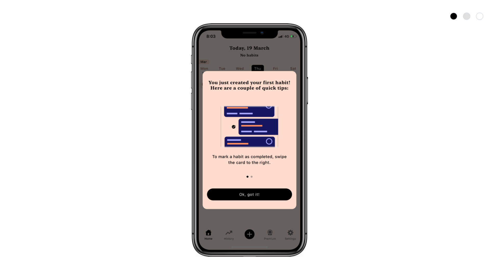
# Recognition rather than recall: 
*Does the app minimize the amount of memorizing the user has to do to proceed through the app?*
| Comments     | Severity Rating |
| ----------- | ----------- |
| This tip should have some sort of visual indicator once this has passed, since this action is not intuitive or easily memorizable.     | 2     |

# Flexibility and efficiency of use: 
*Does the app provide learnable but not necessary accelerators to allow experienced users to move more efficiently?*
| Comments     | Severity Rating |
| ----------- | ----------- |
| This tip is a good accelerator that will help out experienced users once the above mentioned reminder/indicator is added.     | 1       |

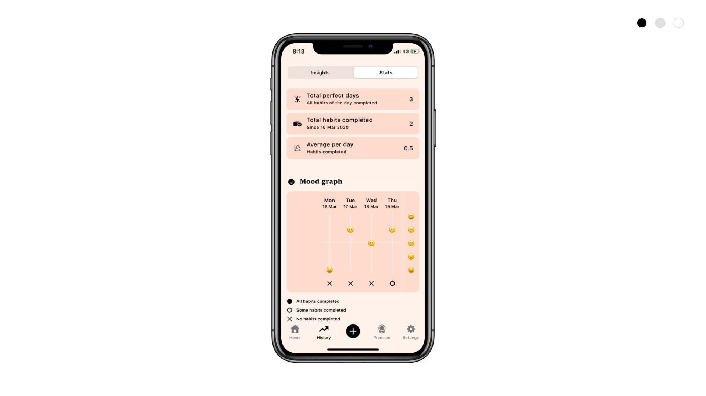
# Aesthetic and minimalist design: 
*Are the imporant functions clearly highlighted and is unnecessary or distraction features removed?*
| Comments     | Severity Rating |
| ----------- | ----------- |
| Not all of the important information or infographics is properly highlighted in a way that communicates clear, important info to the user. Furthermore, there is a lot of extraneous information.   | 3      |
| More focus should be put on the graph and what exactly it means to the users. Extra information such as the emojis are not useful nor clear.  | 3        |

# Help users recognize, diagnose, and recover from errors: 
*Does the app allow for easy and clear diagnosing of any errors the user might encounter?*
| Comments     | Severity Rating |
| ----------- | ----------- |
| Tangerine does not provide any sort of extra information that would help users fix errors or any sort of FAQ. These should be added.     | 3      |

# Help and documentation: 
*Does the app provide useful information that may aid the user through any troubles or questions they might encounter?*
| Comments     | Severity Rating |
| ----------- | ----------- |
| Tangerine does not provide any sort of real feedback on if what is tracked is actually useful or helpful at the moment. However, this is not a severe issue as freedom is a central aspect of journaling.  | 1      |
| Providing more of a guide or even examples of a good habit description would eliminate this issue.  | 1      |
